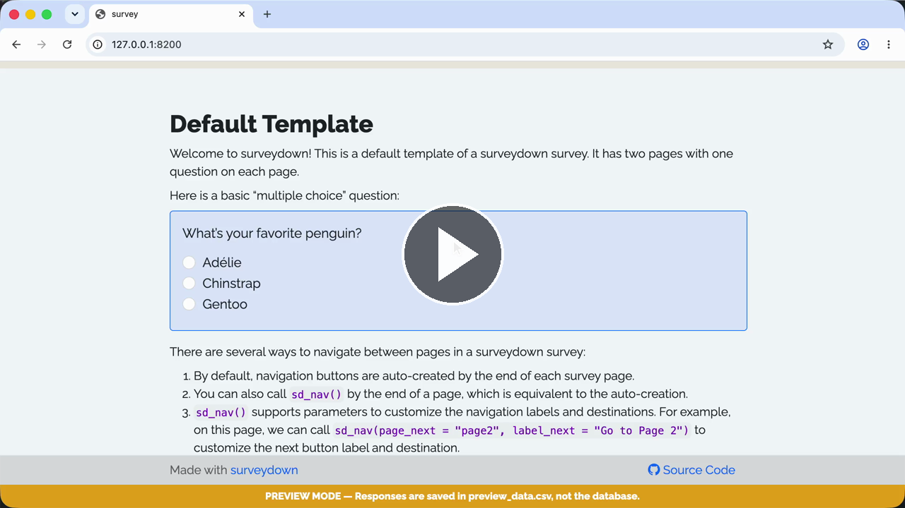

# Template - Default

A minimum template for starting from scratch.

### See it in action

Watch the **Walkthrough recording:**

[](https://cdn.jsdelivr.net/gh/surveydown-dev/template_default@main/video-recording.mp4)

### Create this template

Run this command in your R console:

```r
surveydown::sd_create_survey(
  #path = "path/to/survey"
)
```

`template = "default"` is the default argument, so you do not need to specify it.

### Learn more

- [Template page - Default](https://surveydown.org/templates/default)
- [Document page - Start with a template](https://surveydown.org/docs/getting-started#start-with-a-template)
